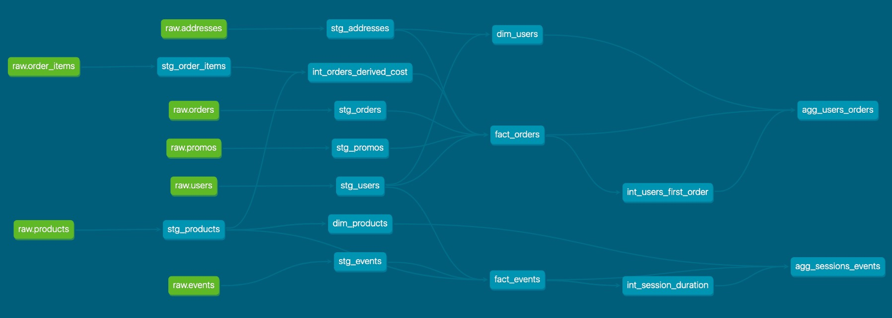

# Weekly Project Assignments

[Week 1 Assignment](#week-1)  
[Week 2 Assignment](#week-2)  
[Week 3 Assignment](#week-3)  
[Week 4 Assignment](#week-4)  

## Week 1

**How many users do we have?**
Answer: 130

```sql
SELECT
  COUNT(DISTINCT user_id) AS number_of_distinct_users -- 130
FROM dbt_chris_f.stg_users;
```

**On average, how many orders do we receive per hour?**
Answer:
Please see this [thread](https://dbt-dth9192.slack.com/archives/C02HPAC9HHU/p1646844846725279)
which outlines various approaches. I answered the question in two different ways:

Approach 1: I counted the number of orders by hour (across the two days) and then computed an overall average. This yielded an overall average of 15.04 orders per hour.

```sql
SELECT
  CAST(AVG(number_of_orders) AS DECIMAL(5,2)) AS average_number_of_orders_per_hour -- 15.04
FROM (
  SELECT
    EXTRACT(HOUR FROM created_at) AS hour_order_created
    ,COUNT(DISTINCT order_id) AS number_of_orders
  FROM dbt_chris_f.stg_orders
  GROUP BY 1
) AS number_of_orders_per_hour;
```

Approach 2: I counted the number of orders by hour/day. I then computed the average across days for each hour.

| hour_order_created      | avg_number_of_daily_orders |
| ----------------------- | -------------------------- |
| 0                       | 7.50                       |
| 1                       | 7.00                       |
| 2                       | 5.50                       |
| 3                       | 6.00                       |
| 4                       | 6.50                       |
| 5                       | 5.00                       |
| 6                       | 6.50                       |
| 7                       | 6.00                       |
| 8                       | 6.00                       |
| 9                       | 7.50                       |
| 10                      | 12.50                      |
| 11                      | 12.50                      |
| 12                      | 6.00                       |
| 13                      | 7.00                       |
| 14                      | 9.00                       |
| 15                      | 8.00                       |
| 16                      | 9.50                       |
| 17                      | 7.50                       |
| 18                      | 7.50                       |
| 19                      | 4.00                       |
| 20                      | 10.00                      |
| 21                      | 7.50                       |
| 22                      | 6.00                       |
| 23                      | 10.00                      |

```sql
SELECT
  hour_order_created
  ,CAST(AVG(number_of_orders) AS DECIMAL(5,2)) AS avg_number_of_daily_orders
FROM (
  SELECT
    EXTRACT(HOUR FROM created_at) AS hour_order_created
    ,created_at::DATE AS created_at_date
    ,COUNT(DISTINCT order_id) AS number_of_orders
  FROM dbt_chris_f.stg_orders
  GROUP BY 1, 2
  ORDER BY 1, 2
) AS number_of_orders_per_hour_day
GROUP BY 1;
```

**On average, how long does an order take from being placed to being delivered?**
Answer: Assuming the date columns are in same time zone, the answer is 3 days 21:24:11 hours.

```sql
SELECT
  -- Confirmed created_at is not_null in dbt test
  SUM(CASE WHEN delivered_at IS NULL THEN 0 ELSE 1 END) AS number_of_deliveries -- 305
  ,AVG(delivered_at - created_at) AS average_time_to_deliver_order_in_days -- 3 days 21:24:11
  ,AVG(EXTRACT(epoch FROM (delivered_at - created_at)))/(60*60*24) AS double_check -- 3.8918 days
FROM
  dbt_chris_f.stg_orders;
```

**How many users have only made one purchase? Two purchases? Three+ purchases?**
Answer:
| number_of_orders        | number_of_users            |
| ----------------------- | -------------------------- |
| 1                       | 25                         |
| 2                       | 28                         |
| 3                       | 34                         |
| 4                       | 20                         |
| 5                       | 10                         |
| 6                       | 2                          |
| 7                       | 4                          |
| 8                       | 1                          |

```sql
SELECT
  number_of_orders
  ,SUM(1) AS number_of_users
FROM (
  SELECT
    user_id
    ,COUNT(DISTINCT order_id) AS number_of_orders
  FROM dbt_chris_f.stg_orders
  GROUP BY user_id
) AS number_of_orders_per_user
GROUP BY number_of_orders
ORDER BY number_of_orders ASC;
```

**On average, how many unique sessions do we have per hour?**
Answer: 39.46 unique sessions per hour

```sql
SELECT
  CAST(AVG(number_of_sessions) AS DECIMAL(5,2)) AS avg_number_of_sessions_per_hour -- 39.46
FROM (
  SELECT
    EXTRACT(HOUR FROM created_at) AS hour_created_at
    ,COUNT(DISTINCT session_id) AS number_of_sessions
  FROM dbt_chris_f.stg_events
  GROUP BY 1
) AS number_of_sessions_per_hour;
```

## Week 2

### (Part 1) Models

**What is our user repeat rate?**
Answer: The repeat rate is **79.84%**

```Repeat Rate = Users who purchased 2 or more times / users who purchased```

```sql
SELECT
  SUM(CASE WHEN number_of_orders > 1 THEN 1 ELSE 0 END) AS number_of_users_who_purchased_two_or_more -- 99
  ,SUM(CASE WHEN number_of_orders > 0 THEN 1 ELSE 0 END) AS number_of_users_who_purchased -- 124
  ,CAST(100.0 * SUM(CASE WHEN number_of_orders > 1 THEN 1 ELSE 0 END) /
    SUM(CASE WHEN number_of_orders > 0 THEN 1 ELSE 0 END) AS DECIMAL(5,2)) AS repeat_rate -- 79.84
FROM (
  SELECT
    user_id
    ,COUNT(DISTINCT order_id) AS number_of_orders
  FROM dbt_chris_f.stg_orders
  GROUP BY user_id
) AS number_of_orders_per_user;
```

**What are good indicators of a user who will likely purchase again? What about indicators of users who are likely NOT to purchase again? If you had more data, what features would you want to look into to answer this question?**

TODO

**More stakeholders are coming to us for data, which is great! But we need to get some more models created before we can help. Create a marts folder, so we can organize our models, with the following subfolders for business units: Core, Marketing, and Product.**

```
greenery
  models
    marts
      core
      marketing
      product
```

**Within each marts folder, create intermediate models and dimension/fact models.**

TODO

**Explain the marts models you added. Why did you organize the models in the way you did?**

```
SELECT
  first_order_has_promotion
  ,COUNT(1) AS number_of_users
  ,CAST(100*AVG(is_repeat_customer) AS DECIMAL(5,2)) AS repeat_rate
FROM dbt_chris_f.agg_users_orders
GROUP BY CUBE(1);
```

| first_order_has_promotion | number_of_users  | repeat_rate |
| ------------------------- | ---------------- | ----------- |
| NULL (i.e.TOTAL)          | 124              | 79.84       |
| 0                         | 110              | 78.18       |
| 1                         | 14               | 92.86       | 

**Use the dbt docs to visualize your model DAGs to ensure the model layers make sense**



### (Part 2) Tests


**We added some more models and transformed some data! Now we need to make sure they’re accurately reflecting the data. Add dbt tests into your dbt project on your existing models from Week 1, and new models from the section above**

**What assumptions are you making about each model? (i.e. why are you adding each test?)**

TODO

**Did you find any “bad” data as you added and ran tests on your models? How did you go about either cleaning the data in the dbt model or adjusting your assumptions/tests?**

TODO

**Apply these changes to your github repo**
Answer: Done

**Your stakeholders at Greenery want to understand the state of the data each day. Explain how you would ensure these tests are passing regularly and how you would alert stakeholders about bad data getting through.**

TODO

## Week 3

TODO

## Week 4

TODO